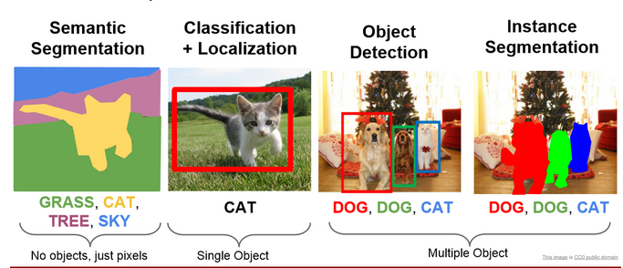
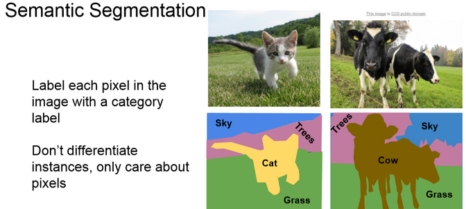
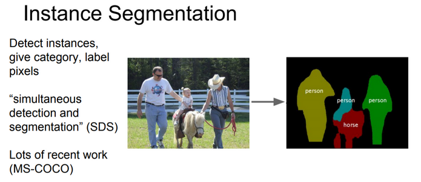
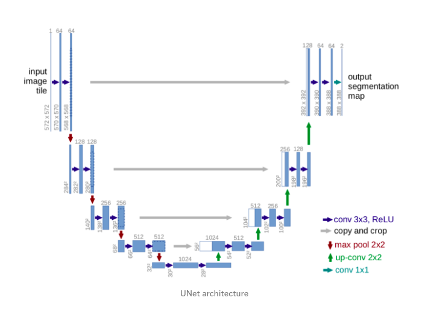

# UNet Explained!!!

## 1) Introduction
There are different tasks in computer vision some of them are listed below: 
- Classification
- Localization
- Semantic Segmentation
- Instance Segmentation

\\
In this blog we will be doing semantic segmentation i.e the 1st picture from left in `fig1`. Image Segmentation is the part of computer vision that comes closest to human vision system. In image segmentation we segregate each pixel into classes. This is how humans percieve their environment. Actually there is an advanced form of semantic segmentation known as instance segmentation i.e the first image from right in `fig1`, that is actually the closest we get to human vision system.

Let's understand the difference between Semantic and Instance Segmentation.

## 2.a) Semantic Segmentation

The goal of semantic segmentation is to classify each pixel of the image into a class. It is a form of pixel-level prediction because each pixel in an image is classified according to a category. If we see the example we can see that pixels occupied by cows are shown with a different color than the sky or the grass.

## 2.b) Instance Segmentation

It is taking a step further from semantic segmentation. Here we even identify boundaries beteen objects of the same class. For example in the example you can see that each person is identified seperately.

## 3) UNet Overview

Till 2015 the state of the art was a sliding window convolution network. In this a small patch of the image is taken and it is passed through a CNN which would output the class that the central pixel of the patch would belong to. You can already see how computationally expensive this method is. To solve the segmentation problem more faster and with less data _Olaf_, _Phillip Fischer_ and _Thomas Brox_ came up with the U-Net. This UNet won the ISBI challenge 2015 and that too with a large margin.

The network is a progression of downsampling followed by upsampling. Downsampling is achieved by maxpooling with stride 2 and the upsampling is achieved by transposed convolutions. Finally, we can use cross entropy loss at pixel level to train this whole network through back propagation.

The main feature that is highlighted in the paper is that UNet is fast and requires less data to train.

## 4) Architecture

You can see from the diagram that the architecture is in the shape of a U. This is where the name UNet came from. The architecture can be divided into 2 parts. The 1st part is an encoder and the second one is a decoder. 

- The contracting layers i.e the encoder part is mainly used for feature extraction. For every two unpadded 3X3 convolution and a RELU layer there is a 2X2 max pooling layer with stride 2 for down sampling. After each downsampling layer the number of channels double. This whole process is done 4 times. If the input image shape is (572X572X1) then it becomes (32X32X512) by the end of encoding part. 

- The bottommost layers has two 3X3 convolution layers but now there is no max pooling.

- Now for the decoder part, 1st operation is a 2X2 up sampling/transpose convolution layer that reduces the number of channels by half, followed by a crop and copy operation i.e concatenation of a previous layer and then two 3X3 unpadded convolution. This whole is done 4 times.

- Now for the final layer. The output from the above operations is depth convolved and the resulting depth of the layers is 2. The depth is 2 beacuse the team was making the model for a Bio medical Image Segmentation task and the number of output classes were 2. It is not compulsory to have 2 as the depth. Many people have tried with more number of classes. Each channel in the last layer contains the probability of each pixel belonging to that class.

There are a total of 23 convolutional layers.

## Special Features of the architecture

- The architecture on first look looks symmetrical but it is not. Due to unpadded convolutions, crop and copy and up sampling operations you can see that the output is not of the same size as the input. The output size is smaller than the input size.

- The encoder part of the model is a feature extracter and stores the features in depth channels.

- The upsampling part has a large number of feature channels. So feature information is passed to higher resolution layers.
This is how the model retains the feature information that it extracted during the contraction phase.

- There is trade off called as the localization and information trade off. The reason is that large image patches require many down sampling layers that reduce the localization accuracy. Now to solve this problem the architects of the model have thought of upsampling from the bottommost layer and then applying a `crop and copy` operation. What this does is that it passes on the localization information from the encoder path to the decoder path. 

- We can see that we are cropping the output of the encoder before concatenating with a decoder layer as both the sizes are not the same.

## Overlap Tile Strategy