# UNet Explained!!!

## 1) Introduction
There are different tasks in computer vision some of them are listed below: 
- Classification
- Localization
- Semantic Segmentation
- Instance Segmentation

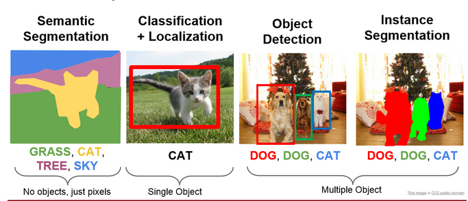

\\
In this blog, we will be learning about a model which does semantic segmentation (`fig1` left). Image Segmentation is the part of computer vision that comes closest to human vision system. In image segmentation, we segregate each pixel into classes. This is how humans perceive their environment. Actually there is an advanced form of semantic segmentation known as instance segmentation (`fig1` right), that is actually the closest we get to human visual system.

Let's understand the difference between Semantic and Instance Segmentation.

## 2.a) Semantic Segmentation

The goal of semantic segmentation is to classify each pixel of the image into a class. It is a form of pixel-level prediction because each pixel in an image is classified according to a category. If we see the example we can see that pixels occupied by cows are shown with a different color than the sky or the grass.

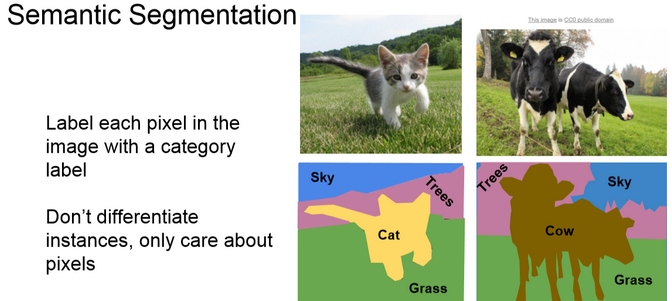

## 2.b) Instance Segmentation

It is taking a step further from semantic segmentation. Here we even identify boundaries between objects of the same class. For example in the example you can see that each person is identified separately.

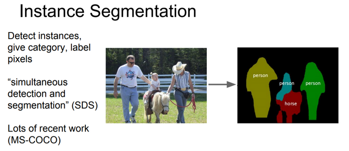

## 3) UNet Overview

Till 2015 the state of the art was a sliding window convolution network. In this, a small patch of the image is taken and it is passed through a CNN which would output the class that the central pixel of the patch would belong to. You can already see how computationally expensive this method is. To solve the segmentation problem more faster and with less data _Olaf_, _Phillip Fischer_ and _Thomas Brox_ came up with the U-Net. This UNet won the ISBI challenge 2015 and that too with a large margin.

The network is a progression of downsampling followed by upsampling. Downsampling is achieved by maxpooling with stride 2 and the upsampling is achieved by transposed convolutions. Finally, we can use cross-entropy loss at the pixel level to train this whole network through backpropagation.

The main feature that is highlighted in the paper is that UNet is fast and requires fewer data to train.

## 4) Architecture

You can see from the diagram that the architecture is in the shape of a U. This is where the name UNet came from. The architecture can be divided into 2 parts. The 1st part is an encoder and the second one is a decoder. 

    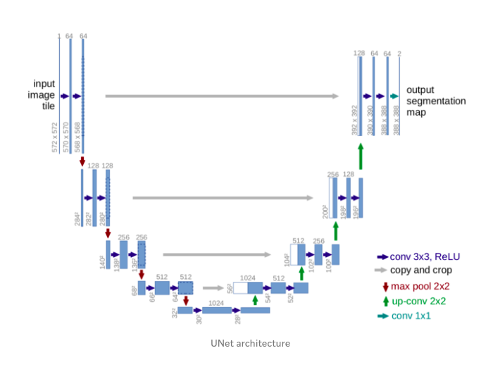

- The contracting layers i.e the encoder part is mainly used for feature extraction. For every two unpadded 3X3 convolutions and a RELU layer, there is a 2X2 max pooling layer with stride 2 for down-sampling. After each downsampling layer, the number of channels double. This whole process is done 4 times. If the input image shape is (572X572X1) then it becomes (32X32X512) by the end of encoding part. 

- The bottommost layers have two 3X3 convolution layers but now there is no max pooling.

- Now for the decoder part, 1st operation is a 2X2 up sampling/transpose convolution layer that reduces the number of channels by half, followed by a crop and copy operation i.e concatenation of a previous layer and then two 3X3 unpadded convolution. This whole is done 4 times.

- Now for the final layer. The output from the above operations is depth convolved and the resulting depth of the layers is 2. The depth is 2 because the team was making the model for a Biomedical Image Segmentation task and the number of output classes were 2. It is not compulsory to have 2 as the depth. Many people have tried with more number of classes. After 1X1 convolution pixelwise softmax is applied. Therefore each channel in the last layer contains the probability of each pixel belonging to that class.

There are a total of 23 convolutional layers.

## 5) Special Features of the architecture

- The architecture on first look looks symmetrical but it is not. Due to unpadded convolutions, crop and copy and upsampling operations you can see that the output is not of the same size as the input. The output size is smaller than the input size.

- The encoder part of the model is a feature extractor and stores the features in-depth channels.

- The upsampling part has a large number of feature channels. So feature information is passed to higher resolution layers.
This is how the model retains the feature information that it extracted during the contraction phase.

- There is trade-off called as the localization and information trade off. The reason is that large image patches require many downsampling layers that reduce the localization accuracy. Now to solve this problem the architects of the model have thought of upsampling from the bottommost layer and then applying a `crop and copy` operation. What this does is that it passes on the localization information from the encoder path to the decoder path. 

- We can see that we are cropping the output of the encoder before concatenating with a decoder layer as both the sizes are not the same.

This is basically it if we only look at the architecture.

Now let's look at some operations that were used in the architecture that some beginners may not know.

## 6) Special operations

- ## Overlap Tile Strategy

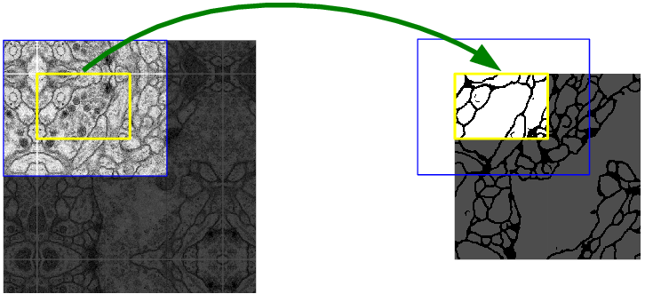
When we use neural networks to generate images, it usually involves up-sampling from low resolution to high resolution. Do not confuse upsampling as the reverse process of max pooling. In max pooling there are no learnable weights where as in transpose convolution the weights are learnable. As convolutions bring a one to many relation between input and output of the layer, upsampling does just the opposite. It brings many to one relation between the input and output.

We have seen that the input size(572X572) is not the same a the output size(388X388). This is because of the reasons discussed above like unpadded convolution, crop and copy, etc. We can see that if we take the yellow patch as input then some percentage of the border information will disappear. To avoid this loss of information the architects have adopted the overlap tile stategy. They increased the size of input image by extrapolating the given image by mirroring the data along the edges and made an image as shown in fig2(left side). Then they took a 572X572 image i.e the blue patch from the newly formed image and then after all operations, we will get the output for the required yellow patch. This allows us to get the output for the whole input image without loss of information.

- ## Up-convolutions / Transpose convolutions / Deconvolution

#### IMP NOTE:- Blue maps are inputs, and cyan maps are outputs.

When we use neural networks to generate images, it usually involves up-sampling from low resolution to high resolution. Do not confuse upsampling as the reverse process of max pooling. In max pooling there are no learnable weights whereas in transpose convolution the weights are learnable. As convolutions bring a one to many relation between input and output of the layer, upsampling does just the opposite. It brings many to one relationship between the input and output.

I recommend reading [this](https://medium.com/@naokishibuya/up-sampling-with-transposed-convolution-9ae4f2df52d0) article to understand transpose convolutions.

## 7) Training

The dataset consists of input images and the true segmentation maps. The input image is passed through the network and after the pixelwise softmax we calculate the cross-entropy loss function. After this stochastic gradient descent with momentum is used to adjust weights. This process goes on for a number of epochs.

Let's go into some mathematics.

- ### Softmax

    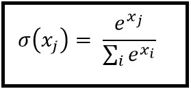

After the 1X1 convolution, we compute the pixel-wise softmax(`fig4`) using the above formula. For computing softmax at a pixel location x and for a feature channel k, we take the exponent of the value at that pixel and divide it by the exponent of all the pixel values across all the depth channels at a location x. 

Well naturally you would ask why softmax? and why not any other function?

The reason is that softmax takes a vector `x` of `k` real values and turns the vector into `k` values whose sum is 1. Therefore each element will lie in between 0 to 1. So we can assume each element of the vector as a probability. This is the most desirable output that we can get out of a network i.e getting the probability of a pixel belonging to a class.

- ### Momentum

Here I am assuming that you have knowledge about gradient descent. 

    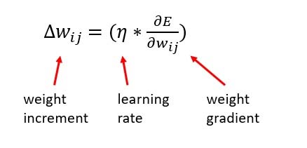
    
Gradient Descent without momentum

As you know gradient descent update always approaches the optimum solution. But which optimum solution? Local or Global?

    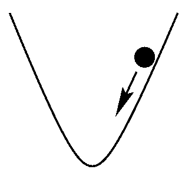
     
    
fig5

    
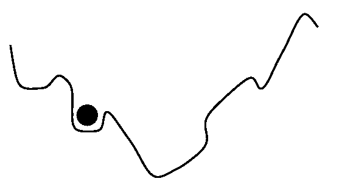

    
fig6

\\
In an ideal case the curve would be quadratic(`fig5`) i.e U shaped and in such a case you will always approach the global minimum. In real senarios this does not happen you will get a shape like shown in `fig6` and you are not garunteed to approach the global minimum, you can be struck at a local minimum. This happens a lot and sometimes we can't understand if the model converged on the solution or not.

To avoid this problem we use momentum. This is an extra term that is added to the gradien descent update term i.e the change in w term. This increases the step size thus avoiding the algorithm to get stuck at local optimum. 

    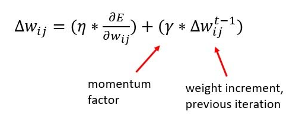
    
Gradient Descent with momentum

There is another use of the momentum term here i.e fast convergence. I won't dive into the mathematics here. I will try to give you an intuition. If you look at a gradient descent without momentum graph(_given below_) you can see that there is a lot of zig zag motion.

    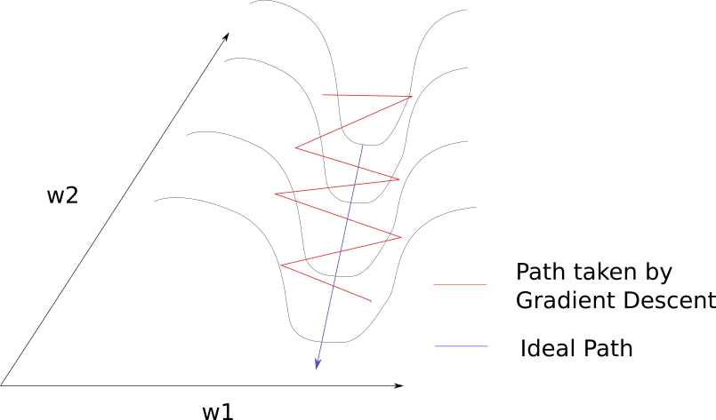

You can observe that the previous step and the current step have a component that cancels out which would reduce the zig zag movement. Therefore by taking the weight increment of the previous step we are reducing the zig zag path by cancelling out the opposite components and thus we make the algorithm approach the minimum faster. 

- ### Cross Entropy Loss

    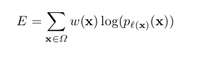

Here `w(x)` is the weight map that was introduced to give some pixels more importance. As mentioned earlier, the authors of the paper were making this model for biomedical imaging dataset. In that dataset, they computed the weight map of each ground truth segmentation to compensate the different frequency of a pixel from certain class. So they had to give the under-represented classes more weight than the others. Also if the weight map would not have been used the model would have ignored the borders easily as they were very thin. 

The weight map is calculated as 

    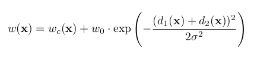

Here w_c(x) is the weight map to balance class frequencies. w_o and sigma in the above function are hyperparameteres. `d1` and `d2` are the distances to the closest and the second closest border. We can observe that w(x) will be greater for borders as `d1` and `d2` will be small which explodes the exponent term. This makes the loss high. Therefore we force the model to learn borders.

## 8) Conclusion

As the authors of the paper said UNet has won the ISBI cell tracking challenge by a large margin. This is a good architecture and I've seen many implementations of the architecture and for different uses. Also this architecture can be trained on limited dataset using extensive data augmentation. I recommend you to read the [paper]() and build the model on your own. 

The next article would be about my implementation of the UNet architecture in PyTorch. I hope this article helped you a lot and I hope this article has stood up to it's name and really explained you all about the UNet architecture

## 9) References
- [UNet — Line by Line Explanation](https://towardsdatascience.com/unet-line-by-line-explanation-9b191c76baf5)
- [Understanding Semantic Segmentation with UNET](https://towardsdatascience.com/understanding-semantic-segmentation-with-unet-6be4f42d4b47)
- [Up-sampling with Transposed Convolution](https://medium.com/@naokishibuya/up-sampling-with-transposed-convolution-9ae4f2df52d0)
- [Optimization in deep learning](https://blog.paperspace.com/intro-to-optimization-momentum-rmsprop-adam/)